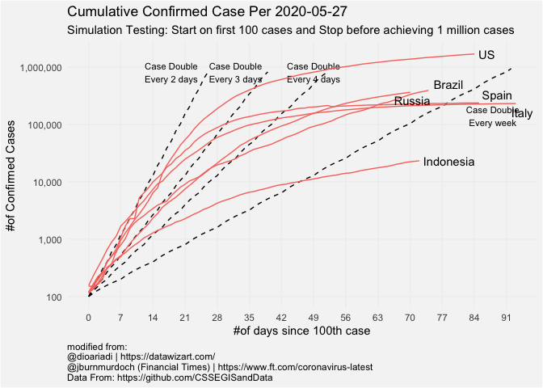
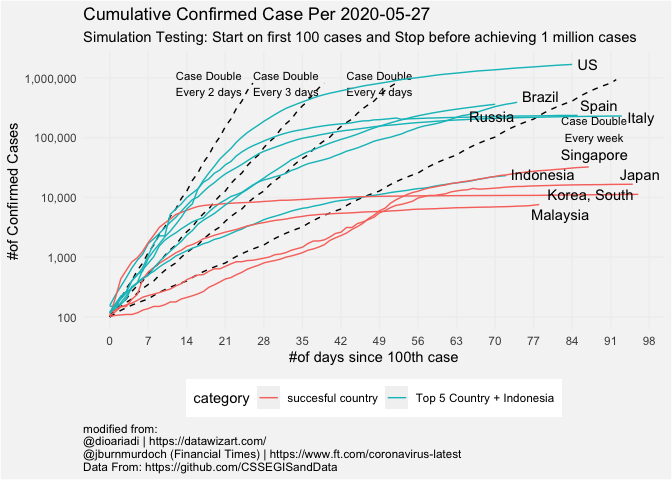
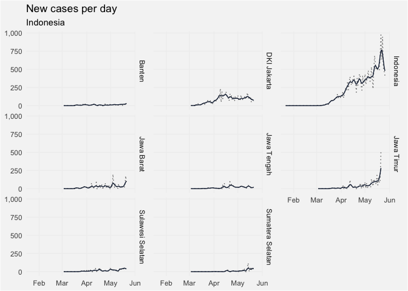
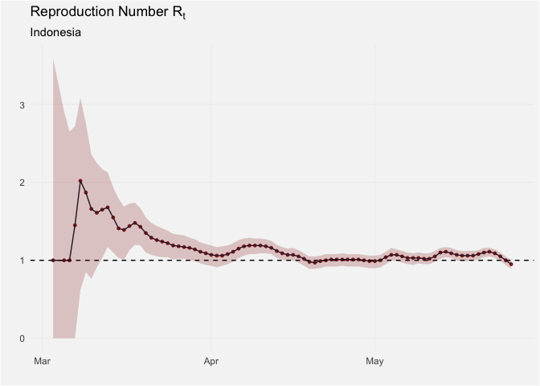
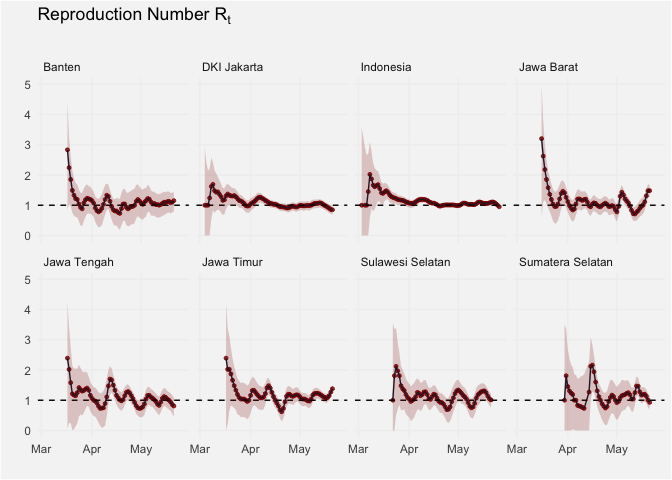
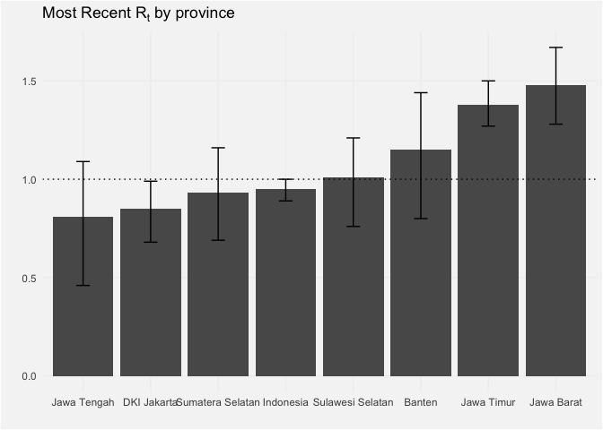

Angka Reproduksi Sebagai Acuan Evaluasi PSBB
================

### Disclaimer

Analisis ini merupakan hasil replikasi yang dimodifikasi untuk
diterapkan pada Data Indonesia. Sumber tertera:

  - [Original Source: Kevin
    Systrom](https://github.com/k-sys/covid-19/blob/master/Realtime%20R0.ipynb)
  - [R version: Ramnath
    Vaidyanathan](https://www.datacamp.com/community/tutorials/replicating-in-r-covid19)
  - \[Graph by @dio\] (<https://github.com/dioariadi/covid-19>)

### Latar Belakang

Secara rutin, pemerintah mengumumkan perkembangan terbaru terkait data
jumlah kasus *covid-19* di Indonesia. Dengan tujuan yang sama pemerintah
pusat dan daerah bersinergi untuk menekan laju infeksi virus ini. Adapun
salah satu langkah strategis yang diambil ialah dengan menerapkannya
**Pembatasan Sosial Berskala Besar (PSBB)**. Kemudian, yang menjadi
pertanyaan kita semua bagaimana langkah ini berdampak pada keberhasilan
pengendalian virus *covid-19*.

### Sekilas Perbandingan Akumulasi Kasus Covid-19

``` r
# Load package
library(tidyverse)
```

    ## Warning: package 'tibble' was built under R version 3.6.2

``` r
library(ggrepel)
library(HDInterval)

source('function collection.R')

#for more data you can visit :
#https://github.com/CSSEGISandData/COVID-19/tree/master/csse_covid_19_data/csse_covid_19_time_series
#https://github.com/dioariadi/covid-19/blob/master/df_indo.csv

urlglobal= 'https://raw.githubusercontent.com/CSSEGISandData/COVID-19/master/csse_covid_19_data/csse_covid_19_time_series/time_series_covid19_confirmed_global.csv'
urlindo = "https://raw.githubusercontent.com/dioariadi/covid-19/master/df_indo.csv"
#downloading and preparing the data
global_data <- readr::read_csv(url(urlglobal))
global_data <- global_data[,!(names(global_data) %in% c('Province/State','Lat','Long'))] #we not use those columns

indo_data <- readr::read_csv(url(urlindo))

#gathering data 
global_data <-
  global_data %>%
  tidyr::pivot_longer(-`Country/Region`, names_to = "data_date", values_to = "cases") %>%
  mutate(data_date = as.Date(data_date, '%m/%d/%y'))
names(global_data) <- c('country','data_date','cases')
```

Untuk sekilas kita dapat membandingkan Indonesia dengan beberapa negara
populer lain yang juga sedang dan atau telah menyelesaikan kasus
covid-19. Terlihat Amerika Serikat (US) masih menjadi negara dengan
kasus terbanyak, bahkan pertumbuhan kasus terlapor sempat menyentuh
angka duplikasi 2 kali lipat setiap 3 hari. Namun demikian, Amerika
serikat masih dalam masa pandemi dimana kasus pertumbuhan kasus *double*
setiap minggunya.

Pada akhirnya negara dengan jumlah kasus terbanyak pun perlahan
menunjukan perlambatan pertumbuhan kasus infeksi. Dikarenakan
partisipasi *susceptible* yang mulai awas (mengkarantina diri) dan juga
di dukung langkah strategis pemerintah setempat.

Berikut gambaran terkait perbandingan Indonesia dengan negara-negara
lain:

``` r
#Now we see how countries around world handling corona virus
#filtering only show top 5 countries + Indonesia
# sequencing from first 100 confirmed cases
top5_list <-
  global_data %>%
  top5_list()

top5_df <-
  global_data %>%
  filter(country %in% (append(unique(top5_list$country),c("Indonesia")))) %>%
  filter(cases>=100) %>%#start when first 100 cases confimed
  arrange(country,data_date) %>%
  group_by(country) %>%
  mutate(seq_ = row_number(),
         category='Top 5 Country + Indonesia')
  
#Top 5 countries
options(repr.plot.width = 40, repr.plot.height = 8)
top5_df %>% cumulative_case_plot(legend=FALSE)
```

<!-- -->

Kemudian, dapat juga kita bandingkan dengan beberapa negara yang di
nilai tanggap dan sukses dalam menangani kasus pandemi ini:

``` r
#Now Compare with Successful Country that successful handling spreading
succ_df <-
  global_data %>%
  filter(country %in%c("Japan","Singapore","Malaysia","Korea, South")) %>%
  filter(cases>=100) %>%#start when first 100 cases confimed
  arrange(country,data_date) %>%
  group_by(country) %>%
  mutate(seq_ = row_number(),
         category='succesful country')
succ_df <- 
  succ_df %>%
  bind_rows(top5_df)

options(repr.plot.width = 40, repr.plot.height = 8)
succ_df %>% cumulative_case_plot(legend = TRUE)
```

<!-- -->
Terkain penurunan ini, beberapa negara sudah melonggarkan dan mencabut
aturan terkait **lockdown** atau karantina di negaranya. Tentu perilaku
ini memerlukan alasan dan perhitungan sendiri untuk mengukur kapan
**lockdown** harus berakhir. Nah, salah satu ukuran yang bisa digunakan
adalah Angka reproduksi.

### Apa itu Angka Reproduksi?

Untuk proses evaluasi kebijakan pandemi, ukuran umum yang digunakan
adalah *Reproduction Number (\(Rt\))* atau angka reproduksi terhadap
waktu.

\(Rt\) akan memberi peringkat pada kemampuan penyebaran sebuah penyakit.
Nilainya menunjukan setiap adanya 1 kasus harian akan memicu beberapa
kali lipat replikasi kasus di waktu berikutnya.

Angka reproduksi yang tinggi (**Rt\>=1**), menandakan peningkatan kasus
secara signifikan. Sebaliknya, angka yang rendah (**Rt\<1 **) menunjukan
pelemahan penularan yang pada akhirnya tidak banyak orang baru tertular.

``` r
province_list <-
  indo_data %>%
  top5_province()

append_data(global_data,indo_data) %>%
  smooth_new_cases() %>%
  plot_new_cases_group()
```

    ## Registered S3 method overwritten by 'xts':
    ##   method     from
    ##   as.zoo.xts zoo

<!-- -->

### Bagaimana menghitung angka reproduksi?

#### Langkah 1 menghitung waktu kedatangan

\(R_{t}\) adalah istihah yang digunakan mengukur ancaman sebuah virus,
dan juga melambangkan angka reproduksi virus corona dalam kasus ini.
Angka ini yang kemudian di monitor untuk proses pengambilan kebijakan
pemerintah di seluruh dunia mengenai pencabutan kasus karantina wilayah
atau PSBB dalam kasus negara kita.

\(R_{t}\) tidak dihitung ketika orang-orang baru saja dinyatakan
positif(dikarena adanya proses inkubasi), melainkan mengunakan data-data
yang terlapor sebelumnya. Dengan asumsi bahwa jumlah kasus hari ke t
(\(R_t\)) dikarenakan jumlah kasus kemarin (\(R_{t-1}\)) dan hari-hari
sebelum nya \(R_{t-m}\). Penulis asli artikel ini (link diatas)
berasumsi bahwa kejadian ini dapat didekati/diperkiraakan menggunakan
teorema bayes.

Teorema bayes digunakan untuk memperbarui `beilefs` tentang nilai asli
dari \(R_t\) berdasarkan jumlah kasus baru yang terlapor setiap harinya.

Teorema bayes yang digunakan:
\[ P(R_t|k)=\frac{P(k|R_t)\cdot P(R_t)}{P(k)} \]

Explanation TBD

``` r
# r_t_range is a vector of possible values for R_t
R_T_MAX = 12
r_t_range = seq(0, R_T_MAX, length = R_T_MAX*100 + 1)

# Gamma is 1/serial interval
# https://wwwnc.cdc.gov/eid/article/26/6/20-0357_article
GAMMA = 1/2

country_selected = "Indonesia"
global_data %>%
  filter(country==country_selected) %>%
  smooth_new_cases() %>%
  compute_likelihood() %>%
  head(4)
```

    ## # A tibble: 4 x 6
    ##   country   data_date  new_cases new_cases_smooth   r_t likelihood_r_t
    ##   <chr>     <date>         <dbl>            <dbl> <dbl>          <dbl>
    ## 1 Indonesia 2020-03-03         0                1  0             -1.11
    ## 2 Indonesia 2020-03-03         0                1  0.01          -1.10
    ## 3 Indonesia 2020-03-03         0                1  0.02          -1.10
    ## 4 Indonesia 2020-03-03         0                1  0.03          -1.10

#### Langkah 2 menghitung posterior

Explanation TBD

``` r
global_data %>%
  filter(country == country_selected) %>%
  smooth_new_cases() %>%
  compute_likelihood() %>%
  compute_posterior() %>%
  head(4)
```

    ## # A tibble: 4 x 6
    ##   country   data_date  new_cases new_cases_smooth   r_t posterior
    ##   <chr>     <date>         <dbl>            <dbl> <dbl>     <dbl>
    ## 1 Indonesia 2020-03-03         0                1  0      0.00303
    ## 2 Indonesia 2020-03-03         0                1  0.01   0.00303
    ## 3 Indonesia 2020-03-03         0                1  0.02   0.00304
    ## 4 Indonesia 2020-03-03         0                1  0.03   0.00305

#### Mengestimasi \(R_t\)

Explanation TBD

``` r
# Estimate R_t and a 95% highest-density interval around it
global_data %>%
  filter(country == country_selected) %>%
  smooth_new_cases() %>%
  compute_likelihood() %>%
  compute_posterior() %>%
  estimate_rt() %>%
  head(4)
```

    ## # A tibble: 4 x 5
    ## # Groups:   country [1]
    ##   country   data_date  r_t_most_likely r_t_lo r_t_hi
    ##   <chr>     <date>               <dbl>  <dbl>  <dbl>
    ## 1 Indonesia 2020-03-03            1         0   3.59
    ## 2 Indonesia 2020-03-05            1         0   2.91
    ## 3 Indonesia 2020-03-06            1         0   2.6 
    ## 4 Indonesia 2020-03-07            1.45      0   2.71

``` r
action_date <-
    tibble(
      data_date =c("Bekerja, Belajar, Beribadah dari rumah","PSBB DKI Jakarta","#dirumahaja campaign","PSBB Bodebek"),
      event = as.Date(c("2020-03-15","2020-04-10","2020-04-13","2020-04-15")))

global_data %>%
  filter(country == country_selected) %>%
  smooth_new_cases() %>%
  compute_likelihood() %>%
  compute_posterior() %>%
  estimate_rt() %>%
  plot_estimates()
```

<!-- -->
\#\#\#\# estimasi buat 4 provinsi besar Explanation TBD

``` r
estimates_all <- append_data(global_data, indo_data) %>%
  group_by(country) %>%
  # Ignore states that have not reached 100 infections
  filter(max(cases) > 100 ) %>%
  group_split() %>%
  map_df(~ {
    .x %>%
      smooth_new_cases() %>%
      compute_likelihood() %>%
      compute_posterior() %>%
      estimate_rt()
  }) %>%
  ungroup()

options(repr.plot.height = 40, repr.plot.width = 20)
estimates_all %>%
  plot_estimates() +
  facet_wrap(~ country, ncol = 4) +
  labs(subtitle = "")
```

<!-- -->
\#\#\#\# Latest Reproduction number Explanation TBD

``` r
estimates_all %>%
  group_by(country) %>%
  dplyr::filter(data_date == max(data_date)) %>%
  ungroup() %>%
  mutate(country = forcats::fct_reorder(country, r_t_most_likely)) %>%
  ggplot(aes(x = country, y = r_t_most_likely)) +
  geom_col()+
  geom_hline(yintercept = 1, linetype = 'dotted') +
  geom_errorbar(aes(ymin = r_t_lo, ymax = r_t_hi), width = 0.2) +
  scale_fill_manual(values = c(None = 'darkred', Partial = 'gray50', Full = 'gray70')) +
  labs(
    title = expression(paste("Most Recent R"[t], " by province")),
    x = '', y = ''
  ) +
  dio_theme
```

<!-- -->
